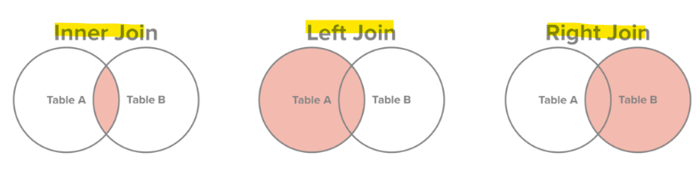
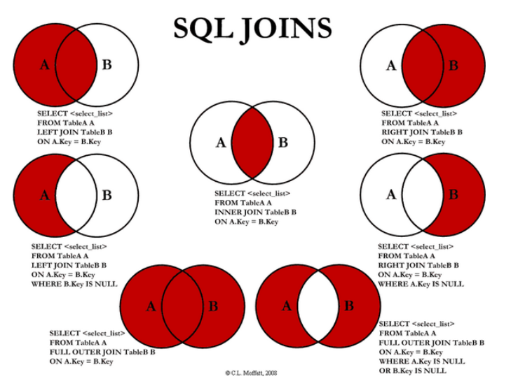
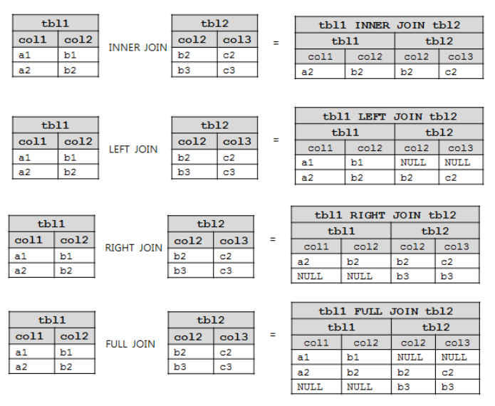

# SQL정리 

- [프로그래머스](https://programmers.co.kr/learn/challenges?tab=sql_practice_kit)
- [해설참고블로그](https://shjz.tistory.com/114)
- 문법 순서

select -> from -> where -> groupby -> having -> order by

- 쿼리실행순서

from -> where -> groupby -> having -> select -> order by 

### DML

* INSERT

  * ```sql
    INSERT into student values(테이블에 맞는 데이터 양식);
    ```

* UPDATE

  * ```sql
    update 테이블 set 칼럽='값' where 조건;
    ```

* DELETE

  * ```sql
    delete from 테이블 where 조건;
    ```

* SELECT

  * ```sql
    select * from student;  = 모든칼럼조회
    ```

  * ```sql
    select age, name from student; = 필요한 칼럼조회
    ```

### DDL

* CREATE

  * 테이블 생성

    ```sql
    create table student(
    칼럼명 타입 조건
    PRIMARY KEY ~~);
    ```

* ALTER

* DROP

* TRUNCATE

* RENAME

### DCL

* GRANT
* REVOKE

### TCL

* COMMIT
* ROLLBACK
* SAVEPOINT

---------------------------------------------------------------------------------------------------------

### Where

- 컬럼 조회의 조건

  ```sql
  select \* from student where id = 1;
  ```

- and, or 조건

  ```sql
  select \* from student where sex='남자' and(or) address='서울';
  ```

- like 조건
  % 로 표현

  ```sql
  select \* from student where name = '김%';
  ```

### HAVING

- WHERE 절에서는 집계함수를 사용 할 수 없다.

-  HAVING 절은 집계함수를 가지고 조건비교를 할 때 사용한다.

-  HAVING절은 GROUP BY절과 함께 사용이 된다.

  ```sql
  SELECT b.dname, COUNT(a.empno) "사원수"
    FROM emp a, dept b
   WHERE a.deptno = b.deptno
   GROUP BY dname
  HAVING COUNT(a.empno) > 5;
  ```

### Limit - 마지막에 작성

- 조회 결과 행의 수 제한

  ```sql
  select \* from student limit 1;
  ```

------

### Group By

- 특정 칼럼 기준의 데이터 그룹핑

  ```sql
  select age from student group by age;
  ```

### Order by

- 특정 칼럼 기준으로 정렬

- ASC : 오름차순 1 2 3 4 5

- DESC : 내림차순 5 4 3 2 1

  ```sql
  select \* from student order by age ASD;
  select \* from student order by age DESC;
  ```

### Distinct

- 중복 행을 제거

  ```sql
  select distinct name from student;
  ```

### Alias

- 칼럼에 별칭을 주고 조회

  ```sql
  select age '나이' from student where id = 3;
  ```

------

### 연산자

- 산술 연산자 : +, -, /, *
- 비교 연산자 : >, <, >=, <=, = ,!=, <>[같지않음],!<[작지않음] , !>[크지않음]
- 논리 연산자 : and, or, not
- 비교 연산자2 : between and, in, is null, like

------

### 함수

**문자 조작 함수**

- UPPER(str) : 대문자 변환

- LOWER(str) : 소문자 변환

- INITCAP(str) : 첫 글자만 대문자로 변환

- CONCAT(str, tmp) : 두 문자값 결합

- SUBSTR(str,a,b) : 문자 추출 a = 시작위치, b = 개수  [**0이라는 주소 없다**]

  *SUBSTR('안녕하세요',1,'2') ▶ 안녕

- LENGTH(str) : 문자열 길이 반환

- L/RPAD(대상,총길이,채울문자열) : 대상 문자열에 채울문자열을 총길이만큼 채워서 반환
  *LPAD('001',7,'0') ▶ 0000001*

- LTRIM, RTRIM(대상, 제거할 문자열) : 대상 문자열에서 제거할 문자열을 없앤 뒤 반환
  *select LTRIM('00010' , '00') ▶ 010*

- REPLACE(대상문자열,바꾸고싶은대상,바꾸고싶은내용) : 대상문자열에서 바꾸고 싶은 대상을 바꾸고 싶은 내용으로 수정한 뒤 반환
  *REPLACE('ABCDEFG','DEF','XXX') ▶ ABCXXXG*

------

**계산 함수**

```sql
SELECT MAX(DATETIME) FROM ANIMAL_INS;
```

- max
- min
- count
- avg
- sum

*select 계산함수(칼럼) from 테이블;* 로 사용

------

### JOIN







#### INNER JOIN

> 일반적인 조인, A와 B 테이블의 조인에서 A와 B 테이블 모두에 있는 레코드만 조회된다.
>
> ```sql
> SELECT A.a, A.b, B.c 
> FROM A
> JOIN B
> ON B.a = A.c;
> ```
>
> ON 대신 WHERE를 사용할 수 있다.

#### LEFT OUTER JOIN

> A와 B 테이블의 조인 상황에서 A테이블 기준으로 B테이블에 A테이블의 칼럼과 일치하는 조건이 없으면 B테이블의 칼럼은 NULL로 조회된다.
>
> ```sql
> SELECT A.a, A.b, B.c 
> FROM A
> LEFT OUTER JOIN B
> ON B.a = A.c;
> ```
>
> outer를 생략할 수 있다.

#### RIGHT OUTER JOIN

> A와 B 테이블의 조인 상황에서 B테이블 기준으로 A테이블에 B테이블의 칼럼과 일치하는 조건이 없으면 A테이블의 칼럼은 NULL로 조회된다.
>
> ```sql
> SELECT A.a, A.b, B.c 
> FROM A
> RIGHT OUTER JOIN B
> ON B.a = A.c;
> ```
>
> 역시 outer를 생략할 수 있다.

#### CROSS JOIN(Cartesian JOIN)

> 집합의 곱 개념으로
> A= {a, b, c, d} , B = {1, 2, 3} 일 때
> A CROSS JOIN B 는
> (a,1), (a, 2), (a,3), (b,1), (b,2), (b,3), (c, 1), (c,2), (c,3), (d, 1), (d, 2), (d,3)의 결과가 된다.
> 결과의 개수는 n(A) * n(B) 이다.
>
> ```sql
> SELECT A.a A.b B.c
> FROM A
> CROSS JOIN B;
> // 위 아래 쿼리의 결과는 같다.
> SELECT A.a, A.b, B.c
> FROM A, B;
> ```

```sql
- 중복제거하고 NULL값 제거한 다음 갯수
SELECT COUNT(DISTINCT NAME) FROM ANIMAL_INS;
```

---------------------------------------------------------------------------------------------------------

```sql
- 그룹으로 묶은 후 갯수 구하면서 정렬시키기
SELECT ANIMAL_TYPE, COUNT(*) FROM ANIMAL_INS Group by ANIMAL_TYPE order by ANIMAL_TYPE;
```

```sql
- 이름, 이름에 따른 갯수 -> 그룹바이로 묶은 후 HAVING을 통해 집계함수 적용하고 정렬시키기
SELECT NAME, count(NAME) FROM ANIMAL_INS GROUP BY NAME HAVING COUNT(NAME) >=2 order by NAME asc;
```

```sql
- SELECT SUBSTR(ANIMAL_OUTS.DATETIME,12,2) as HOUR, count(*) as COUNT from ANIMAL_OUTS GROUP BY HOUR HAving hour >= 9 Order by hour asc;

datetime형식에서는 hour로 시간만 가져올 수 있다. 이걸 토대로 적용!
SELECT  hour(datetime) hour,count(*)
from animal_outs
group by hour
having hour>=9 and hour<=19
order by hour asc
```

-------------------------------------------------------------------------------------------------------

재귀함수를 이용한 것 중요!!!

```sql
- 재귀함수를 이용한 가상 테이블 형성한 후 합치기
WITH RECURSIVE TB_HOUR(HOUR) AS (   #재귀 테이블명(필드명)
  SELECT 0                          # 0부터
  UNION ALL
  SELECT HOUR+1 FROM TB_HOUR        # +1하면서
    LIMIT 24                        # 24개만
)

SELECT A.HOUR, IFNULL(B.COUNT, 0) FROM TB_HOUR A LEFT OUTER JOIN(
SELECT 
    HOUR(DATETIME) AS HOUR
    , COUNT(*) AS COUNT
FROM 
    ANIMAL_OUTS 
GROUP BY 
    HOUR(DATETIME) 
ORDER BY 
    HOUR
    ) B ON A.HOUR = B.HOUR
```

```sql
- set구문을 이용하여 푼 방식
SET @HOUR = -1;
SELECT (@HOUR := @HOUR +1) AS HOUR,
	(SELECT COUNT(*) FROM ANIMAL_OUTS WHERE HOUR(DATETIME) = @HOUR) AS COUNT 
FROM ANIMAL_OUTS 
WHERE @HOUR < 23;
```

----------------------------------------------------------------------------------------------------------

null에 대한 것

```sql
- 아이디 출력 이름이 null인 것 출력
SELECT ANIMAL_ID FROM ANIMAL_INS WHERE NAME is null;

- 아이디 출력 이름이 null이 아닌 것 정렬 출력
SELECT ANIMAL_ID FROM ANIMAL_INS WHERE NAME is not null order by ANIMAL_ID ASC;

- COALESCE(열,열이없을시 대입할 값)
SELECT ANIMAL_TYPE ,COALESCE(NAME,'No name'), SEX_UPON_INTAKE FROM ANIMAL_INS;
```

----------------------------------------------------------------------------------------------------

JOIN

```sql
SELECT B.ANIMAL_ID, B.NAME #B의 아이디와 이름
FROM ANIMAL_INS A          #A = 왼쪽
RIGHT JOIN ANIMAL_OUTS B   #B = 오른쪽
ON A.ANIMAL_ID = B.ANIMAL_ID  
WHERE A.ANIMAL_ID is NULL;  #A와 B의 같은것 토대로 null인 것 찾자.
```

```sql
SELECT B.ANIMAL_ID, B.NAME 
FROM ANIMAL_INS A, ANIMAL_OUTS B
WHERE A.ANIMAL_ID = B.ANIMAL_ID
AND A.DATETIME > B.DATETIME
order by A.DATETIME;
```

```sql
SELECT A.NAME, A.DATETIME
FROM ANIMAL_INS A
LEFT JOIN ANIMAL_OUTS B ON A.ANIMAL_ID = B.ANIMAL_ID
WHERE B.ANIMAL_ID is Null
order by A.DATETIME
LIMIT 3;
```

```sql
SELECT A.ANIMAL_ID, A.ANIMAL_TYPE, A.NAME
FROM ANIMAL_INS A
INNER JOIN ANIMAL_OUTS B ON A.ANIMAL_ID = B.ANIMAL_ID
WHERE A.SEX_UPON_INTAKE <> B.SEX_UPON_OUTCOME;
```

--------------------------------------------------------------------------------------------------------

String, Date

```sql
SELECT ANIMAL_ID, NAME, SEX_UPON_INTAKE FROM ANIMAL_INS
WHERE NAME IN('Lucy','Ella', 'Pickle', 'Rogan', 'Sabrina', 'Mitty') ;
```

```sql
SELECT  ANIMAL_ID,
        NAME,
        IF(SEX_UPON_INTAKE REGEXP 'Neutered|Spayed', 'O' , 'X') 
---정규식 표현 REGEXP ~|~ = or과 같은 구조---        
AS 중성화
FROM    ANIMAL_INS
```

```sql
SELECT A.ANIMAL_ID , A.NAME
FROM ANIMAL_INS A, ANIMAL_OUTS B
WHERE A.ANIMAL_ID = B.ANIMAL_ID
order by DATEDIFF(A.DATETIME, B.DATETIME) limit 2;

#DATEDIFF
----SELECT DATEDIFF(dd,'2018-01-01','2018-12-31') + 1----
---결과 365----
```

```sql
SELECT ANIMAL_ID, NAME, DATE_FORMAT(DATETIME, '%Y-%m-%d') AS 날짜 FROM ANIMAL_INS;

---DATE_FORMAT(필드명, 변환형식)---

```